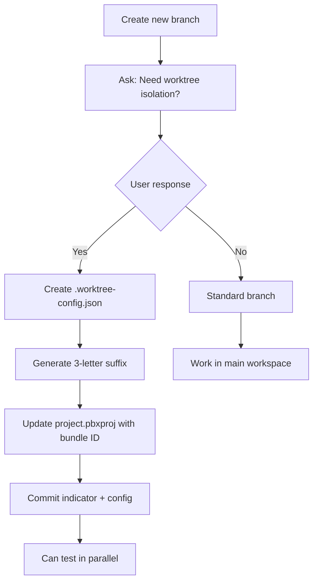

# Git Workflow (GitHub Flow)

**Philosophy**: Simple, agent-friendly branching. All work happens in feature branches merged to `main` via PRs.

## For AI Agents: Natural Language Commands

When the user asks you to work on features or fixes, follow this pattern:

### Start new work
- User says: *"Create a feature branch for X"*
- You: Prompt user: "Should this branch need worktree isolation for parallel development? (yes/no)"
  - If **yes**: Create `.worktree-config.json` indicator file, then apply bundle ID configuration
  - If **no**: Create standard branch, work normally in main workspace
- Then: Create branch `feature/descriptive-name` from `main`

### Work in progress
- User says: *"Commit this work"*
- You: Stage changes, commit with descriptive message
- User says: *"Push changes"*
- You: `git push -u origin <branch>` (sets up tracking automatically)

### Ready to merge
- User says: *"Create a PR"* or *"Open pull request"*
- You: `gh pr create --fill` (uses commits for title/body)
- User says: *"Merge the PR"*
- You: `gh pr merge --squash --delete-branch` (cleans up automatically)

### Create releases
- User says: *"Create release v0.1.0"* or *"Tag this as v0.2.0"*
- You: Update `Version.xcconfig`, commit, then `git tag vX.Y.Z && git push origin vX.Y.Z`
- GitHub Actions will build DMG and create release automatically

### Emergency fixes
- User says: *"Hotfix for X"*
- You: Branch from `main` as `hotfix/short-description`, fix, PR, merge, tag patch version

## Key Commands for Agents

```bash
# Create feature branch
git checkout main && git pull && git checkout -b feature/name

# Create PR (interactive title/body)
gh pr create --fill

# Create PR (custom)
gh pr create --title "Title" --body "Description"

# Merge and cleanup
gh pr merge --squash --delete-branch

# Create release tag
git tag v0.1.0 && git push origin v0.1.0

# View PR status
gh pr status

# Check current branch
git branch --show-current
```

## Branch Naming Conventions

- Features: `feature/descriptive-name`
- Bug fixes: `bugfix/issue-description` or `fix/short-name`
- Hotfixes: `hotfix/critical-fix`
- Refactors: `refactor/what-changed`

## Release Process

1. Ensure `main` is stable and tested
2. Update version in `Version.xcconfig`
3. Commit version bump: `git commit -m "Bump version to vX.Y.Z"`
4. Create and push tag: `git tag vX.Y.Z && git push origin vX.Y.Z`
5. GitHub Actions automatically:
   - Builds the app (Release configuration)
   - Creates DMG installer
   - Publishes GitHub Release with DMG attached
   - Updates download statistics

## GitHub Pages Deployment

- Website deploys automatically from `main` branch, `/docs` folder
- Changes to `docs/` go live within 1-2 minutes after merge to `main`
- Download statistics updated daily via GitHub Actions (`.github/workflows/update-download-stats.yml`)
- Configure at: https://github.com/dburkhardt/muesli/settings/pages

## Hotfix Workflow

When a critical bug is found in production:

1. Create hotfix branch from `main`: `git checkout -b hotfix/critical-fix`
2. Fix the bug, test thoroughly
3. Update version in `Version.xcconfig` (bump patch: 0.1.0 → 0.1.1)
4. Commit and push
5. Create PR, get quick review
6. Merge to `main`
7. Tag the release: `git tag v0.1.1 && git push origin v0.1.1`
8. GitHub Actions builds and releases automatically

## Bundle ID Management for Feature Branches

Most branches work fine in the standard workspace. **Worktree isolation is optional** and only needed for parallel development.

### Worktree Indicator File

Branches that need worktree isolation include a `.worktree-config.json` file in the branch root:

```json
{
  "needsWorktree": true,
  "suffix": "xxx",
  "bundleId": "com.muesli.app.xxx",
  "productName": "Muesli-xxx",
  "reason": "parallel development with main branch"
}
```

### When to Use Worktree Isolation

**Use when**:
- Testing multiple branches simultaneously
- Long-lived feature branches
- Side-by-side comparison with main
- Need TCC permission isolation

**Skip when**:
- Short-lived branches
- Quick fixes or hotfixes
- Single-branch workflow

### Configuration Flow



### Quick Reference

- Main branch: `com.muesli.app` (no suffix)
- Feature branches with worktree: `com.muesli.app.<suffix>`
- Update both Debug and Release configurations in `project.pbxproj`
- Auto-configure: `./scripts/configure-worktree.sh`

For full details, see [AGENTS.md](../AGENTS.md#branch-development).

## Tools

- **GitHub CLI** (`gh`): Required for PR management from command line
- **Git**: Standard git commands for branching, committing, tagging
- **Xcode**: Build and test commands via `xcodebuild`

## Why GitHub Flow?

- **Simple**: No complex branching model
- **Agent-friendly**: Natural language commands map directly to git/gh CLI
- **Fast**: Direct path from feature branch to production
- **Safe**: All changes reviewed via PR before merge
- **Automated**: Releases trigger automatically from tags
