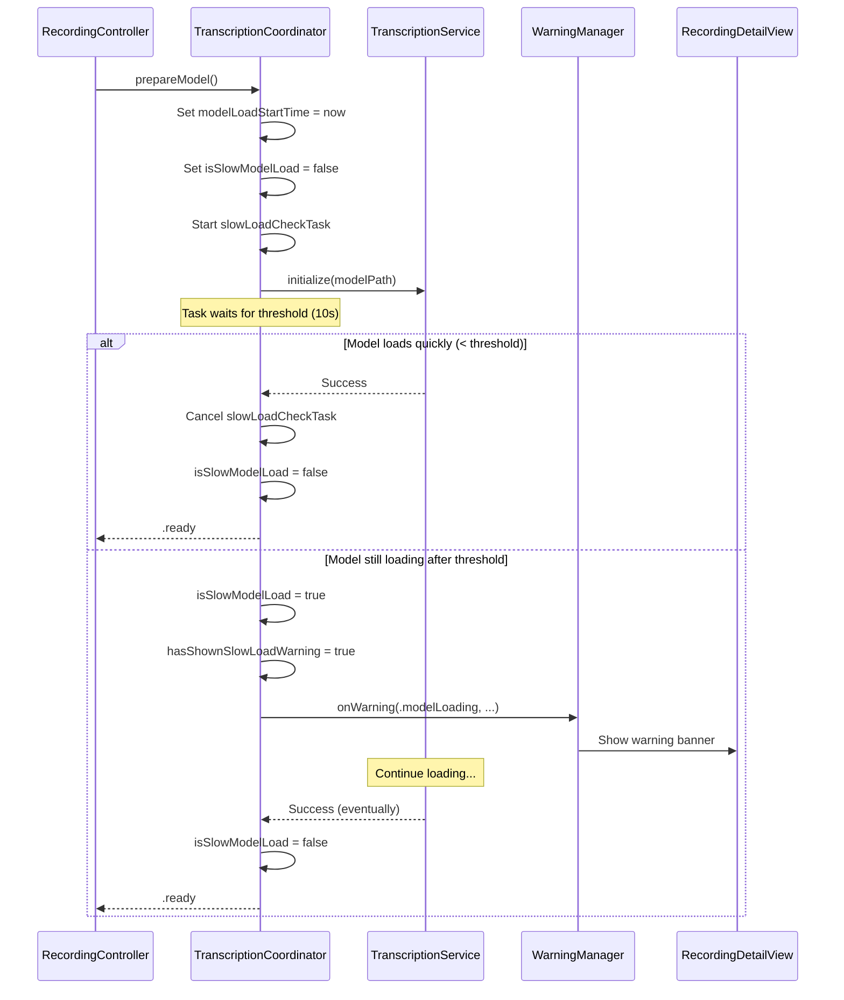
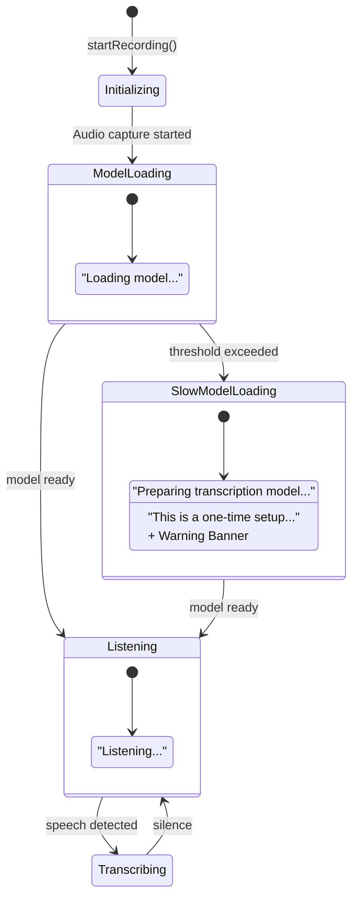
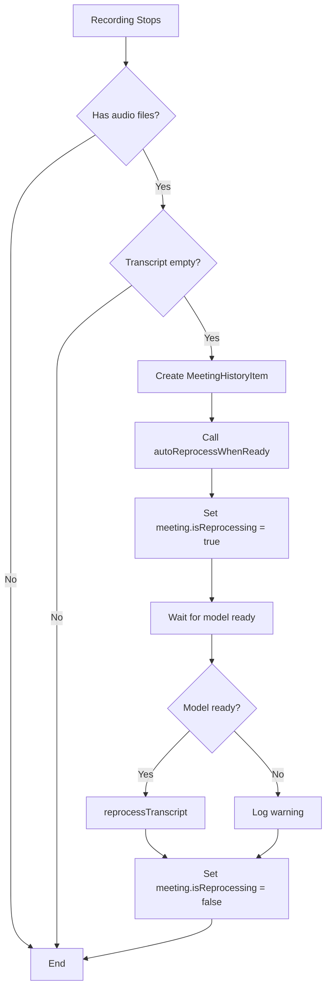
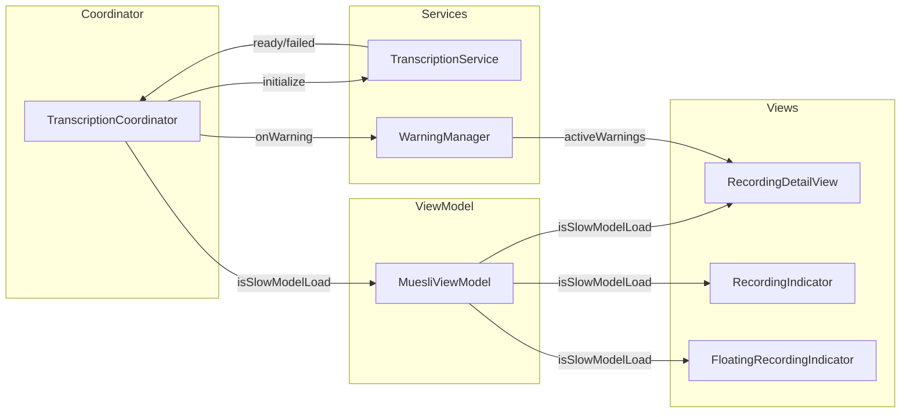

# Model Compilation Detection

This document describes how Muesli detects and handles first-time WhisperKit model compilation, providing user-friendly feedback during the extended loading period.

## Problem

When a WhisperKit model is used for the first time on a device, CoreML compiles and specializes it for the specific hardware. This can take 2-5 minutes for larger models (e.g., Large v3 Turbo), during which:

- Users see no transcription output
- The app appears unresponsive
- Users may think the app is broken and stop their recording

## Solution Overview

Muesli detects slow model loading and provides:

1. **Visual feedback** - Updated UI placeholders and indicators
2. **Warning notification** - Explains the one-time setup
3. **Empty-transcript rescue reprocessing** - Recovers recordings that complete before the model is ready

## Architecture

### Key Components

| Component | Responsibility |
|-----------|---------------|
| `TranscriptionCoordinator` | Detects slow loads, manages timing state, triggers warnings |
| `MuesliViewModel` | Exposes `isSlowModelLoad` to views |
| `RecordingController` | Runs automatic finalization and triggers empty-transcript rescue when needed |
| `RecordingIndicator` | Shows contextual tooltips |
| `RecordingDetailView` | Shows detailed placeholder messages |
| `WarningManager` | Displays non-blocking warning banner |

### State Properties

```swift
// TranscriptionCoordinator
var modelLoadStartTime: Date?           // When loading started
var isSlowModelLoad: Bool = false       // True after threshold exceeded
private var hasShownSlowLoadWarning: Bool = false  // Prevents duplicate warnings
private var slowLoadCheckTask: Task<Void, Never>?  // Detection task (cancellable)
private let slowLoadThreshold: TimeInterval = 10.0 // Configurable threshold
```

## Flow Diagrams

### Model Loading with Slow-Load Detection



### UI State During Recording



### Empty-Transcript Rescue Flow



### Component Interaction



## UI Feedback Details

### Placeholder Messages

| State | Icon | Primary Text | Secondary Text |
|-------|------|--------------|----------------|
| Normal Loading | ProgressView (small) | "Loading model..." | "Transcript will appear shortly" |
| Slow Loading | ProgressView (large) | "Preparing transcription model..." | "This is a one-time setup that may take a few minutes." |
| Ready | Waveform | "Listening..." | "Transcript will appear here as you speak" |

### RecordingIndicator Tooltip

| State | Tooltip |
|-------|---------|
| Normal Loading | "Transcription model loading..." |
| Slow Loading | "Model preparing for first use (one-time setup)..." |

### Warning Banner

When slow load is detected, a warning banner appears with:

- **Title**: "Model preparing for first use"
- **Message**: Explains that first-time setup takes a few minutes, recording is active, and audio is being captured
- **canRetry**: false (user cannot retry, just needs to wait)

## Configuration

The slow-load threshold is injectable for testing:

```swift
init(
    transcriptionService: any TranscriptionServiceProtocol,
    modelManager: any ModelManagerProtocol,
    slowLoadThreshold: TimeInterval = 10.0  // Default: 10 seconds
)
```

Production uses the default 10-second threshold. Tests can use shorter values (e.g., 0.1s) for faster execution.

## Edge Cases

### Recording Stops Before Model Ready

If a user stops recording before the model finishes loading:

1. Audio files are saved (`audio.caf`, `microphone.caf`)
2. Automatic finalization is attempted when enabled and duration/audio gates pass
3. If finalization does not launch and transcript is empty, system detects: `hasAudioFiles && hasEmptyTranscript`
4. `autoReprocessWhenReady()` is called as rescue
5. Meeting shows "Reprocessing..." spinner in UI
6. When model is ready, transcript is generated from saved audio

### Multiple Recordings in Quick Succession

Each call to `prepareModel()`:
- Cancels any existing `slowLoadCheckTask`
- Resets `isSlowModelLoad` to false
- Resets `hasShownSlowLoadWarning` to false
- Starts a new detection task

This ensures each recording gets fresh detection state.

### Reset Between Recordings

`resetForNewRecording()` clears all slow-load state:

```swift
func resetForNewRecording() {
    // ... existing reset logic ...
    
    // Reset slow-load detection state
    slowLoadCheckTask?.cancel()
    slowLoadCheckTask = nil
    modelLoadStartTime = nil
    isSlowModelLoad = false
    hasShownSlowLoadWarning = false
}
```

## Testing

Unit tests cover:

| Test | Purpose |
|------|---------|
| `testIsSlowModelLoad_isFalse_initially` | Verify initial state |
| `testIsSlowModelLoad_remainsFalse_duringFastLoad` | Fast loads don't trigger |
| `testIsSlowModelLoad_becomesTrue_afterThreshold` | Slow loads are detected |
| `testSlowLoadWarning_firesOnlyOnce` | No duplicate warnings |
| `testResetForNewRecording_clearsSlowLoadState` | State cleanup works |
| `testSlowLoadTask_cancelledOnSuccess` | Task lifecycle management |
| `testModelLoadStartTime_isSetDuringLoading` | Timing tracked correctly |

The `MockTranscriptionService` supports an `initializationDelay` property to simulate slow model loading in tests.

## Related Files

- `Muesli/Managers/TranscriptionCoordinator.swift` - Core detection logic
- `Muesli/Controllers/RecordingController.swift` - Automatic finalization + empty-transcript rescue trigger
- `Muesli/ViewModels/MuesliViewModel.swift` - State exposure
- `Muesli/Views/RecordingDetailView.swift` - UI feedback
- `Muesli/Views/Components/RecordingIndicator.swift` - Indicator tooltips
- `MuesliTests/TranscriptionCoordinatorTests.swift` - Unit tests
